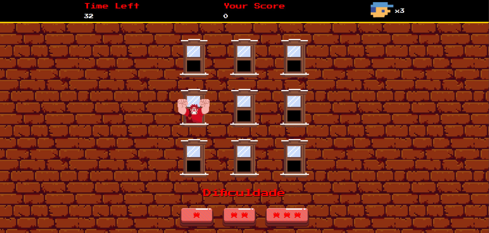

# 🎮 Jogo do Ralph

Este é um jogo simples desenvolvido em **JavaScript**, **HTML** e **CSS**, onde o personagem **Ralph** aparece nas janelas de um prédio. O objetivo do jogo é clicar no quadrado correto onde o Ralph aparece enquanto o jogo se move rapidamente com base na dificuldade selecionada. O projeto inclui diferentes modos de dificuldade e mecânicas para tornar o jogo mais dinâmico e desafiador.

## 🚀 Funcionalidades

- **Modos de Dificuldade**: O jogador pode selecionar entre diferentes níveis de dificuldade que afetam a velocidade do jogo.
- **Sistema de Pontuação e Vidas**: O jogador acumula pontos ao clicar no quadrado correto onde Ralph aparece. Perde uma vida ao clicar no quadrado errado.
- **Feedback Sonoro**: Sons são tocados tanto quando o jogador clica corretamente quanto quando erra.
- **Imagens do Personagem Ralph**: Utilizamos imagens criadas por Pablo Araujo para dar vida ao personagem Ralph nas janelas do prédio, criando uma sensação de imersão no ambiente do jogo.

## 📥 Instalação

Para jogar, basta clonar ou baixar o repositório e abrir o arquivo `index.html` em seu navegador.

```bash
git clone https://github.com/DavigfxSs/jogo-do-ralph.git
cd jogo-do-ralph
```

## 👏 Créditos

- **Imagens do Ralph e Janela**: As imagens usadas para o personagem Ralph e a janela do prédio foram fornecidas por **pablwoAraujo**. Agradecemos pelo excelente trabalho visual!

## 🎮 Como Jogar

1. Inicie o jogo clicando no botão de "Iniciar".
2. Escolha o nível de dificuldade:
   - **Fácil**: Velocidade normal do movimento de Ralph.
   - **Médio**: A velocidade aumenta, tornando o jogo mais rápido.
   - **Difícil**: A velocidade do movimento de Ralph aumenta ainda mais, tornando o jogo muito desafiador.
3. Quando Ralph aparecer em uma janela, clique rapidamente no quadrado correspondente.
4. Se clicar no quadrado errado, perderá uma vida. ps. dependendo da dificuldade o custo de vidas por clicar errado pode ser maior
5. O objetivo é acumular o maior número de pontos possível antes de perder todas as suas vidas.

## 🖼️ Tela do Jogo


## 🚧 Funcionalidades Planejadas

- [ ] Adicionar mais personagens ou itens no jogo.
- [ ] Incluir efeitos de animação mais elaborados.
- [ ] Melhorar o sistema de pontuação e o feedback visual.

## 📝 Licença

Este projeto é de código aberto e está disponível sob a licença MIT.
